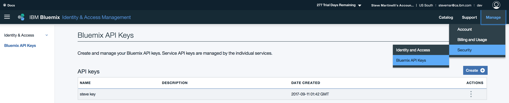

[](https://travis-ci.org/IBM/container-journey-template)

# Container Journey template - Creating a Kubernetes Cluster

*Read this in other languages: [한국어](README-ko.md).*

This scenario provides instructions for the following tasks:
- Install the Bluemix CLI and associated repos
- Install the CLIs for using the Kubernetes API
- Create a Kubernetes cluster with one worker node


## Step 1. Setting up the Bluemix CLI

Install the IBM Bluemix Container Service CLI, the image registry CLI, and their prerequisites. These CLIs are used in later lessons and are required to manage your Kubernetes cluster from your local machine, create images to deploy as containers, and in a later tutorial, deploy apps into the cluster.


1. If you do not have one yet, create a [Bluemix account](https://console.ng.bluemix.net/registration/). Make note of your user name and password as this information is required later.

> For **Linux** users, you can clone this repo and run `bash linux.sh`. Then, move on to [Step 2](#step-2-setting-up-your-cluster-environment).

2. As a prerequisite for the Bluemix Container Service plug-in, install the [Bluemix CLI](http://clis.ng.bluemix.net/ui/home.html). The prefix for running commands by using the Bluemix CLI is `bx`.

> For **Mac** users, after you have installed the Bluemix CLI, you can clone this repo and run `bash osx.sh` in your terminal. Then move on to [Step 2](#step-2-setting-up-your-cluster-environment).


3. Log into the Bluemix CLI with username and password
    ```bash
    $ bx login -a https://api.ng.bluemix.net
    API endpoint: https://api.ng.bluemix.net

    Email> myemail@email.com

    Password>
    Authenticating...
    OK

    Select an account (or press enter to skip):
    1. Stuff (8b05eb34e24005a6a1f9ba77f565fe2d)
    Enter a number> 1  (note that not entering a number will cause this to fail)
    Targeted account Stuff (8b05eb34e24005a6a1f9ba77f565fe2d)

    Targeted org test.org

    Targeted space test

    API endpoint:   https://api.ng.bluemix.net (API version: 2.75.0)
    Region:         us-south
    User:           email@example.com
    Account:        Stuff (8b05eb34e24005a6a1f9ba77f565fe2d)
    Org:            test.org
    Space:          test
    ```

4. Alternatively, if you are using Single Sign-On, you can authenticate with Bluemix by using an API key. To create an API key, navigate to the _Manage_ -> _Security_ -> _Bluemix API Keys_ menu option, or go directly to: [https://console.bluemix.net/iam/#/apikeys](https://console.bluemix.net/iam/#/apikeys). Click the _Create_ button to create a new API key.

> Note: Once created, you will not be able to view the API key again, so save it somewhere safe!



You can now use the API key to authenticate with Bluemix by using the `bx login --apikey <apikey>`.

    ```bash

    $ bx login --apikey bNUsU0vpX3ZXWUZvnSDowFDGUR8EZfTdHnJelsQvlhPr
    API endpoint: https://api.ng.bluemix.net
    Authenticating...
    OK

    Targeted account IBM (47b84451ab70b94737518f7640a9ee42) <-> 1323471

    Targeted resource group default

    API endpoint:     https://api.ng.bluemix.net (API version: 2.75.0)
    Region:           us-south
    User:             stevemar@ca.ibm.com
    Account:          IBM (47b84451ab70b94737518f7640a9ee42) <-> 1323471
    Resource group:   default
    Org:
    Space:
    ```

5. To create Kubernetes clusters and manage worker nodes, install the Bluemix Container Service plug-in. The prefix for running commands by using the Bluemix Container Service plug-in is `bx cs`.
    ```bash
    $ bx plugin repo-add Bluemix https://plugins.ng.bluemix.net
    $ bx plugin install container-service -r Bluemix
    ```

6. Initialize the Bluemix Container Service plug-in.
    ```bash
    $ bx cs init
    ```

7. To view a local version of the Kubernetes dashboard and to deploy apps into your clusters, install the [Kubernetes CLI](https://kubernetes.io/docs/user-guide/prereqs/). The prefix for running commands by using the Kubernetes CLI is kubectl.

    **a. Download the Kubernetes CLI.**

    OS X: http://storage.googleapis.com/kubernetes-release/release/v1.5.3/bin/darwin/amd64/kubectl

    Linux: http://storage.googleapis.com/kubernetes-release/release/v1.5.3/bin/linux/amd64/kubectl

    Windows: http://storage.googleapis.com/kubernetes-release/release/v1.5.3/bin/windows/amd64/kubectl.exe

    **b. For OSX and Linux users, convert the binary file to an executable.**

    ```bash
    $ chmod +x kubectl
    ```
    Make sure that /usr/local/bin is listed in your PATH system variable. The PATH variable contains all directories where your operating system can find executable files. The directories that are listed in the PATH variable serve different purposes. /usr/local/bin is used to store executable files for software that is not part of the operating system and that was manually installed by the system administrator.

    ```bash
    $ echo $PATH
    /usr/local/bin:/usr/bin:/bin:/usr/sbin:/sbin
    ```
    Move the executable file to the /usr/local/bin directory
    ```bash
    $ sudo mv kubectl /usr/local/bin/kubectl
    ```

Congratulations! You successfully created your Bluemix account and installed the CLIs for the following lessons and tutorials. Next, access your cluster by using the CLI.

## Step 2: Setting up your cluster environment

1. Create your free Kubernetes cluster
    ```bash
    $ bx cs cluster-create --name [your_cluster_name]
    ```
    A free cluster comes with one worker node to deploy container pods upon. A worker node is the compute host, typically a virtual machine, that your pods run on. A pod is a group of one or more containers, the shared storage for those containers, and the options about how to run them. The pod model is as an "application specific logical host", which means it contains one or more application containers which are relatively tightly coupled.

> **Note:** It can take up to 2 hours for the worker node machine to be ordered, and for the cluster to be set up and provisioned.

2. Before you continue to the next step, verify that the deployment of your worker node is complete.
    ```bash
    $ bx cs workers [your_cluster_name]
    ID                                           Public IP       Private IP    Machine Type  State     Status   
    dal10-pa8dfcc5223804439c87489886dbbc9c07-w1  169.47.223.113  10.171.42.93  free         deployed  Deploy Automation                                          Successful   
    ```

3. Set the context for your cluster in your CLI. Every time you log in to the IBM Bluemix Container Service CLI to work with the cluster, you must run these commands to set the path to the cluster's configuration file as a session variable. The Kubernetes CLI uses this variable to find a local configuration file and certificates that are necessary to connect with the cluster in Bluemix.

    a. Download the configuration file and certificates for your cluster using the `cluster-config` command.
    ```bash
    $ bx cs cluster-config [your_cluster_name]
    export KUBECONFIG=/Users/ibm/.bluemix/plugins/cs-cli/clusters/wordpress/kube-config-dal10-wordpress.yml
    ```

    b. Copy and paste the command from the previous step to set the KUBECONFIG environment variable and configure your CLI to run kubectl commands against your cluster.

4. From here you should be able to verify that your Kubernetes credentials are working by running the kubectl-specific version of the bx cs workers command above:
    ```bash
    $ kubectl get nodes
    NAME             STATUS    AGE       VERSION
    184.172.242.18   Ready     3h        v1.5.6-4+abe34653415733
    ```

Great work! The cluster is created, configured, and your local environment is ready for you to start deploying apps into the cluster. To make sure it's running as it should, let's run the simple Docker hello-world container app on our new cluster.

    $ kubectl run -i --tty hw --image=hello-world --restart=Never

    Hello from Docker!
    This message shows that your installation appears to be working correctly.

    To generate this message, Docker took the following steps:
    1. The Docker client contacted the Docker daemon.
    2. The Docker daemon pulled the "hello-world" image from the Docker Hub.
    3. The Docker daemon created a new container from that image which runs the
    executable that produces the output you are currently reading.
    4. The Docker daemon streamed that output to the Docker client, which sent it
    to your terminal.

    To try something more ambitious, you can run an Ubuntu container with:
    $ docker run -it ubuntu bash

    Share images, automate workflows, and more with a free Docker ID:
    https://cloud.docker.com/

    For more examples and ideas, visit:
    https://docs.docker.com/engine/userguide/

That's it, you can now go back to the Journey that brought you here!
