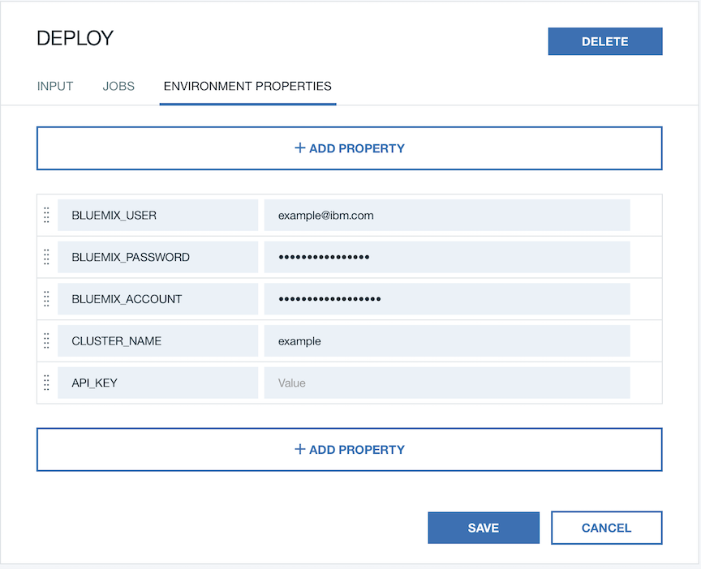

# Toolchain Instructions

*Read this in other languages: [한국어](Toolchain_Instructions-ko.md).*

> Note: This toolchain instructions is based on this [tutorial](https://developer.ibm.com/recipes/tutorials/deploy-kubernetes-pods-to-the-bluemix-container-service-using-devops-pipelines).

1. Click the **Deploy to Bluemix** button to fork the repo into your GitHub account.

2. If you have not authenticated to GitHub you will see an Authorize button.

3. Once the repository is forked, you will be taken to the Bluemix Continuous Delivery toolchain setup. This toolchain has been defined by the template in the sample repository.

> **Important**: If you already forked that project, you can sync your current forked project with our master branch to trigger a new build in your current toolchain. You can obtain more information on how to sync your repository via https://help.github.com/articles/syncing-a-fork/
> 
> However, if you really want to create a new toolchain, please change your **repository type** to *clone* or *existing*. 

4. Click the Create button. This will generate a toolchain that looks like the following:

5. Select the Delivery Pipeline tile from the toolchain view to open the pipeline stages view.

6. The pipeline executes immediately after being created. The Deploy stage will fail on the first run because we are missing your account information for authentication. Click on the gear at the top right corner of the Deploy stage to select Configure Stage.

7. Set the following environment properties

    BLUEMIX_USER – your Bluemix user ID.
    
    BLUEMIX_PASSWORD – your Bluemix password.
    
    BLUEMIX_ACCOUNT – The GUID of the Bluemix account where you created the cluster. Retrieve it with `bx iam accounts`.
    
    CLUSTER_NAME – Your cluster name. Retrieve it with `bx cs clusters`. 

    API_KEY (Optional) - API_KEY is for login to your account. It is recommended for **Federated ID** since Federated ID can't login with Bluemix user and password via Bluemix CLI. You can obtain your API_KEY via https://console.ng.bluemix.net/iam/#/apikeys by clicking **Create API key** (Each API key only can be viewed once). 

> Note: **Federated ID** means your organization uses a federated identity to authenticate with Bluemix.
   

8. Run the Deploy stage using the Run Stage button at the top righthand side of the stage’s card. This time the Deploy stage will succeed and the application will be deployed.
    

9. Click **View logs and history** of the Deploy stage to find the URL of the application.

10. Congratulation, now you can click the URL link to load the application in your browser. Note it takes a few seconds from the time the pods deploy until they are ready to serve requests.
