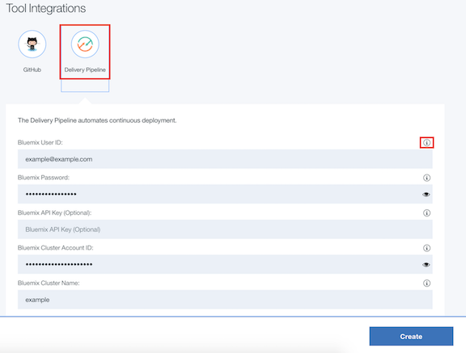

# Toolchain Instructions

*Read this in other languages: [한국어](Toolchain_Instructions_new-ko.md).*

> Note: This toolchain instructions is based on this [tutorial](https://developer.ibm.com/recipes/tutorials/deploy-kubernetes-pods-to-the-bluemix-container-service-using-devops-pipelines).

1. Click the **Deploy to Bluemix** button.

2. If you have not authenticated to GitHub you will see an Authorize button.

3. Click **Delivery Pipeline** and fill in all the non-optional environment variables before you click the create button.

> You can view more information about each environment variable by clicking the information button.

Here are some common environment variables for deploying applications on Kubernetes.

- Bluemix API Key (Optional) - API Key is for login to your account. It is recommended for **Federated ID** since Federated ID can't login with Bluemix user and password via Bluemix CLI. You can obtain your API_KEY via https://console.ng.bluemix.net/iam/#/apikeys by clicking **Create API key** (Each API key only can be viewed once). 

> Note: **Federated ID** means your organization uses a federated identity to authenticate with Bluemix.
>
> If you filled in your Bluemix API Key, you can leave the **Bluemix User ID**, **Password**, and **Cluster Account ID** section blank.

- Bluemix User ID– your Bluemix user ID. 

- Bluemix Password – your Bluemix password. 

- Bluemix Cluster Account ID – The GUID of the Bluemix account where you created the cluster. Retrieve it with `bx iam accounts`.

- Bluemix Cluster Name – Your cluster name. Retrieve it with `bx cs clusters`.

4. After you filled in your environment variables, click **CREATE**. Once the repository is cloned on your GitHub, you will be taken to the Bluemix Continuous Delivery toolchain setup. 

5. Select the Delivery Pipeline tile from the toolchain view to open the pipeline stages view.

6. Click **View logs and history** of the Deploy stage to find the URL/Endpoint of the application.

7. Congratulation, now you can click the URL link to load the web application in your browser. For other applications, you can also find the applcation endpoint at the end of your logs. Note it takes a few seconds from the time the pods deploy until they are ready to serve requests.
